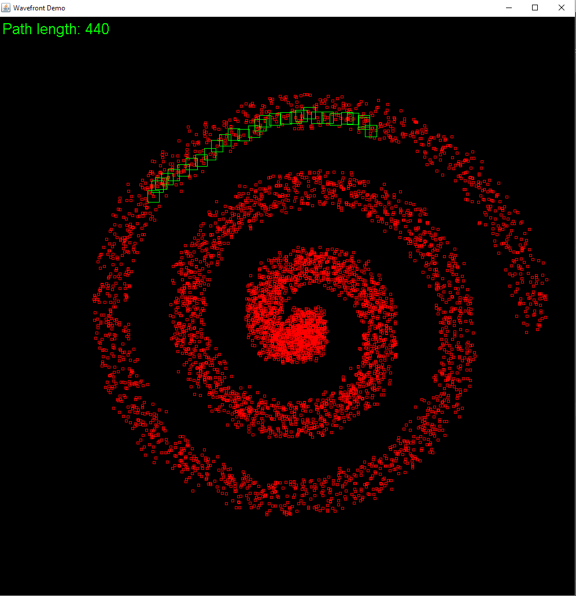

# Minimal wavefront implementation

  

Wavefront is a dynamic programming algorithm to find the distance from one location (node) to
all other locations. The result can be used for example in path planning
 (by following the gradient). The algorithm is widely used e.g. in robotics.
 
 This repository contains a minimal, yet general, wavefront implementation, that is defined by
 four functions
 * Neighborhood function (gives all neighbors of a node)
 * Cost function (pairwise distance between nodes)
 * Getter for node's current cost
 * Setter for node's current cost
 
 
 ## Usage:
 
 See and run Demo application in test folder for example usage (image above). 
